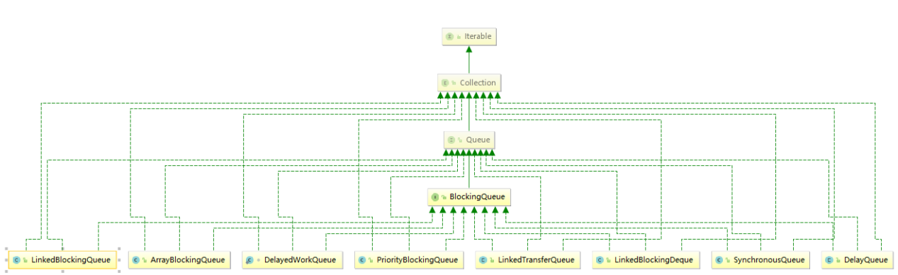
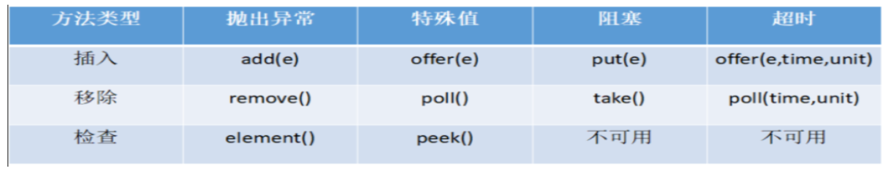
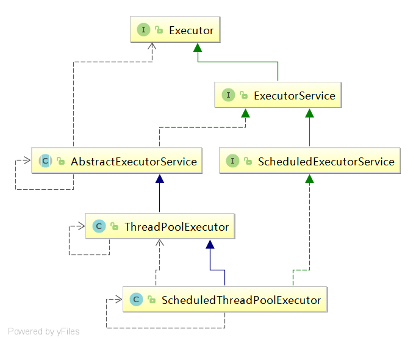
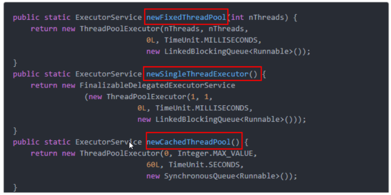

## JUC 下 锁的实现是基于AQS 的

参考文档：

[Java并发之 AQS 深入解析(上) - 简书](https://www.jianshu.com/p/62ed0767471e)

## 线程池的实现原理


##  java中的常见异常（比较重要）

1. ==java.util.ConcurrentModificationException并发修改异常==
2. ==OOM(out of memory) 内存溢出异常== 


## 常见问题

==wait和sleep:wait是放开手去睡，放开手里的锁；sleep握紧手去睡，醒了手里还有锁。==

==在高内聚低耦合的前提下，线程          操作（对外暴露的调用方法）           资源类==

java中线程的状态

```java
    public enum State {
        /**
         * Thread state for a thread which has not yet started.
         */
        NEW,

        /**
         * Thread state for a runnable thread.  A thread in the runnable
         * state is executing in the Java virtual machine but it may
         * be waiting for other resources from the operating system
         * such as processor.
         */
        RUNNABLE,

        /**
         * Thread state for a thread blocked waiting for a monitor lock.
         * A thread in the blocked state is waiting for a monitor lock
         * to enter a synchronized block/method or
         * reenter a synchronized block/method after calling
         * {@link Object#wait() Object.wait}.
         */
        BLOCKED,

        /**
         * Thread state for a waiting thread.
         * A thread is in the waiting state due to calling one of the
         * following methods:
         * <ul>
         *   <li>{@link Object#wait() Object.wait} with no timeout</li>
         *   <li>{@link #join() Thread.join} with no timeout</li>
         *   <li>{@link LockSupport#park() LockSupport.park}</li>
         * </ul>
         *
         * <p>A thread in the waiting state is waiting for another thread to
         * perform a particular action.
         *
         * For example, a thread that has called <tt>Object.wait()</tt>
         * on an object is waiting for another thread to call
         * <tt>Object.notify()</tt> or <tt>Object.notifyAll()</tt> on
         * that object. A thread that has called <tt>Thread.join()</tt>
         * is waiting for a specified thread to terminate.
         */
        WAITING,//一直等的状态

        /**
         * Thread state for a waiting thread with a specified waiting time.
         * A thread is in the timed waiting state due to calling one of
         * the following methods with a specified positive waiting time:
         * <ul>
         *   <li>{@link #sleep Thread.sleep}</li>
         *   <li>{@link Object#wait(long) Object.wait} with timeout</li>
         *   <li>{@link #join(long) Thread.join} with timeout</li>
         *   <li>{@link LockSupport#parkNanos LockSupport.parkNanos}</li>
         *   <li>{@link LockSupport#parkUntil LockSupport.parkUntil}</li>
         * </ul>
         */
        TIMED_WAITING,//有时间限制的等待

        /**
         * Thread state for a terminated thread.
         * The thread has completed execution.
         */
        TERMINATED;
    }
```

## 1、经典买票，使用Lock

```java
//先有资源，资源中有暴露的操作，再有线程用操作来操作资源
package com.whu.juc;

import java.util.concurrent.locks.Lock;
import java.util.concurrent.locks.ReentrantLock;

/**
 * @author Date 2019/11/16-15:07
 */
class Ticket{
    private int number=30;
    private Lock lock=new ReentrantLock();
    public void saleTicket(){
        lock.lock();
        try{
            if (number>0) {
                System.out.println(Thread.currentThread().getName()+"这是第"+number+"张票"+"---还剩"+(--number)+"票");
            }
        }catch(Exception e){
            e.printStackTrace();
        }finally{
            lock.unlock();
        }//这部分代码块是可以提出来做模板

    }
}

public class SaleTicket {
    public static void main(String[] args) {
        Ticket ticket=new Ticket();
        //下面的代码块也可以提出来做模板
        new Thread(()->{for (int i = 1; i < 40; i++)ticket.saleTicket(); },"A").start();
        new Thread(()->{for (int i = 1; i < 40; i++)ticket.saleTicket(); },"B").start();
        new Thread(()->{for (int i = 1; i < 40; i++)ticket.saleTicket(); },"C").start();
    }
}

```

## 2、线程协作

wait and notify

==生产者和消费者：判断/干活/通知==

```java
//1.0版本生产消费者问题
package com.whu.juc;

/**
 * @author Date 2019/11/16-22:18
 */
class Cheese{
    private int number=0;
    public synchronized void increment() throws InterruptedException {
        //判断
        if (number != 0) {
            this.wait();
        }
        //干活
        ++number;
        System.out.println(Thread.currentThread().getName()+"\t"+number);
        //通知
        this.notifyAll();
    }
    public synchronized void decrement() throws InterruptedException {
        if (number == 0) {
            this.wait();
        }
        --number;
        System.out.println(Thread.currentThread().getName()+"\t"+number);
        this.notifyAll();
    }

}
public class ThreadWaitNotifyDemo {
    public static void main(String[] args) {
        Cheese c=new Cheese();
        new Thread(()->{
            for (int i = 0; i < 10; i++) {
                try {
                    c.increment();
                } catch (InterruptedException e) {
                    e.printStackTrace();
                }
            }
        },"A").start();
        new Thread(()->{
            for (int i = 0; i < 10; i++) {
                try {
                    c.decrement();
                } catch (InterruptedException e) {
                    e.printStackTrace();
                }
            }
        },"B").start();
    }
}

```

==多线程交互中，必须防止多线程的虚假唤醒，也即判断只能用while不能用if，这里指的是同步块代码中的判断==

```java
//2.0生产消费者，多个
package com.whu.juc;

/**
 * @author Date 2019/11/16-22:18
 */
class Cheese{
    private int number=0;
    public synchronized void increment() throws InterruptedException {
            while (number != 0) {
            this.wait();
        }
        ++number;
        System.out.println(Thread.currentThread().getName()+"\t"+number);
        this.notifyAll();
    }
    public synchronized void decrement() throws InterruptedException {
        while (number == 0) {
            this.wait();
        }
        --number;
        System.out.println(Thread.currentThread().getName()+"\t"+number);
        this.notifyAll();
    }

}
public class ThreadWaitNotifyDemo {
    public static void main(String[] args) {
        Cheese c=new Cheese();
        new Thread(()->{
            for (int i = 0; i < 10; i++) {
                try {
                    c.increment();
                } catch (InterruptedException e) {
                    e.printStackTrace();
                }
            }
        },"A").start();
        new Thread(()->{
            for (int i = 0; i < 10; i++) {
                try {
                    c.decrement();
                } catch (InterruptedException e) {
                    e.printStackTrace();
                }
            }
        },"B").start();
        new Thread(()->{
            for (int i = 0; i < 10; i++) {
                try {
                    c.increment();
                } catch (InterruptedException e) {
                    e.printStackTrace();
                }
            }
        },"C").start();
        new Thread(()->{
            for (int i = 0; i < 10; i++) {
                try {
                    c.decrement();
                } catch (InterruptedException e) {
                    e.printStackTrace();
                }
            }
        },"D").start();
    }
}
//升级版写法


/**
 * @author Date 2019/11/16-22:18
 */
class Cheese{
    private int number=0;
    private Lock lock=new ReentrantLock();
    private Condition condition=lock.newCondition();
    public void increment() throws InterruptedException {
        lock.lock();
        try{
            while (number != 0) {
                condition.await();//this.wait();
            }
            ++number;
            System.out.println(Thread.currentThread().getName()+"\t"+number);
            condition.signalAll();
        }catch(Exception e){
            e.printStackTrace();
        }finally{
            lock.unlock();
        }
    }
    public void decrement() throws InterruptedException {
        lock.lock();
        try{
            while (number == 0) {
                condition.await();//this.wait();
            }
            --number;
            System.out.println(Thread.currentThread().getName()+"\t"+number);
            condition.signalAll();
        }catch(Exception e){
            e.printStackTrace();
        }finally{
            lock.unlock();
        }
    }

}
public class ThreadWaitNotifyDemo {
    public static void main(String[] args) {
        Cheese c=new Cheese();
        new Thread(()->{
            for (int i = 0; i < 10; i++) {
                try {
                    c.increment();
                } catch (InterruptedException e) {
                    e.printStackTrace();
                }
            }
        },"A").start();
        new Thread(()->{
            for (int i = 0; i < 10; i++) {
                try {
                    c.decrement();
                } catch (InterruptedException e) {
                    e.printStackTrace();
                }
            }
        },"B").start();
        new Thread(()->{
            for (int i = 0; i < 10; i++) {
                try {
                    c.increment();
                } catch (InterruptedException e) {
                    e.printStackTrace();
                }
            }
        },"C").start();
        new Thread(()->{
            for (int i = 0; i < 10; i++) {
                try {
                    c.decrement();
                } catch (InterruptedException e) {
                    e.printStackTrace();
                }
            }
        },"D").start();
    }
}

```

==标志位==

```java
//精准打击，精准唤醒案例，这里的标志位说的是同步块中的number不是flag
package com.whu.juc;

/**
 * @author Date 2019/11/17-10:07
 * 多线程之间按顺序调用 A->B->C
 * A打印5次 B打印10次 C打印15次接着A打印5次...
 * 按这样的顺序做10次
 */
class SharedResources{
    private int number=1;//1:A 2:B 3:C
    private Lock lock=new ReentrantLock();
    private Condition condition1=lock.newCondition();
    private Condition condition2=lock.newCondition();
    private Condition condition3=lock.newCondition();
    public void print(int tag){
        if (tag == 1) {
            lock.lock();
            try{
                while (number != 1) {
                    condition1.await();
                }
                for (int i = 0; i < 5; i++) {
                    System.out.println(Thread.currentThread().getName()+"\t"+i);
                }
                number=2;
                condition2.signal();

            }catch(Exception e){
                e.printStackTrace();
            }finally{
                lock.unlock();
            }
        } else if (tag == 2) {
            lock.lock();
            try{
                while (number != 2) {
                    condition2.await();
                }
                for (int i = 0; i < 10; i++) {
                    System.out.println(Thread.currentThread().getName()+"\t"+i);
                }
                number=3;
                condition3.signal();

            }catch(Exception e){
                e.printStackTrace();
            }finally{
                lock.unlock();
            }
        } else if (tag == 3) {
            lock.lock();
            try{
                while (number != 3) {
                    condition3.await();
                }
                for (int i = 0; i < 15; i++) {
                    System.out.println(Thread.currentThread().getName()+"\t"+i);
                }
                number=1;
                condition1.signal();

            }catch(Exception e){
                e.printStackTrace();
            }finally{
                lock.unlock();
            }
        }
    }

}
public class ThreadOrderAccess {
    public static void main(String[] args) {
        SharedResources sharedResources = new SharedResources();
        new Thread(()->{
            for (int i = 0; i < 10; i++) {
                sharedResources.print(1);
            }
        },"A").start();
        new Thread(()->{
            for (int i = 0; i < 10; i++) {
                sharedResources.print(2);
            }
        },"B").start();
        new Thread(()->{
            for (int i = 0; i < 10; i++) {
                sharedResources.print(3);
            }
        },"C").start();

    }
}

```

## 3、8锁问题

```java
一个对象里面如果有多个synchronized方法，某一个时刻内，只要一个线程去调用其中的一个synchronized方法了，
其它的线程都只能等待，换句话说，某一个时刻内，只能有唯一一个线程去访问这些synchronized方法
锁的是当前对象this，被锁定后，其它的线程都不能进入到当前对象的其它的synchronized方法


加个普通方法后发现和同步锁无关
换成两个对象后，不是同一把锁了，情况立刻变化。
 

synchronized实现同步的基础：Java中的每一个对象都可以作为锁。
具体表现为以下3种形式。
对于普通同步方法，锁是当前实例对象。
对于静态同步方法，锁是当前类的Class对象。
对于同步方法块，锁是Synchonized括号里配置的对象
 
当一个线程试图访问同步代码块时，它首先必须得到锁，退出或抛出异常时必须释放锁。
 
也就是说如果一个实例对象的非静态同步方法获取锁后，该实例对象的其他非静态同步方法必须等待获取锁的方法释放锁后才能获取锁，
可是别的实例对象的非静态同步方法因为跟该实例对象的非静态同步方法用的是不同的锁，
所以毋须等待该实例对象已获取锁的非静态同步方法释放锁就可以获取他们自己的锁。
 
所有的静态同步方法用的也是同一把锁——类对象本身，
这两把锁(this/Class)是两个不同的对象，所以静态同步方法与非静态同步方法之间是不会有竞态条件的。
但是一旦一个静态同步方法获取锁后，其他的静态同步方法都必须等待该方法释放锁后才能获取锁，
而不管是同一个实例对象的静态同步方法之间，
还是不同的实例对象的静态同步方法之间，只要它们同一个类的实例对象！
 
 //测试代码
 package com.atguigu.thread;
 
import java.util.concurrent.TimeUnit;
 
 
class Phone
{
 
 public  synchronized void sendSMS() throws Exception
 {
   
   System.out.println("------sendSMS");
 }
 public synchronized void sendEmail() throws Exception
 {
   System.out.println("------sendEmail");
 }
 
 public void getHello() 
 {
   System.out.println("------getHello");
 }
 
}
 
/**
 * 
 * @Description: 8锁
 * 
 1 标准访问，先打印短信还是邮件
 2 停4秒在短信方法内，先打印短信还是邮件
 3 新增普通的hello方法，是先打短信还是hello
 4 现在有两部手机，先打印短信还是邮件
 5 两个静态同步方法，1部手机，先打印短信还是邮件
 6 两个静态同步方法，2部手机，先打印短信还是邮件
 7 1个静态同步方法,1个普通同步方法，1部手机，先打印短信还是邮件
 8 1个静态同步方法,1个普通同步方法，2部手机，先打印短信还是邮件
 * ---------------------------------
 * 
 */
public class Lock_8
{
 public static void main(String[] args) throws Exception
 {
 
   Phone phone = new Phone();
   Phone phone2 = new Phone();
   
   new Thread(() -> {
    try {
     phone.sendSMS();
    } catch (Exception e) {
     e.printStackTrace();
    }
   }, "AA").start();
   
   Thread.sleep(100);
   
   new Thread(() -> {
    try {
     phone.sendEmail();
     //phone.getHello();
     //phone2.sendEmail();
    } catch (Exception e) {
     e.printStackTrace();
    }
   }, "BB").start();
 }
}
 
 
 
```

## 4 、集合安全问题

### 4.1、List不安全

```java
package com.whu.juc;

import java.util.*;
import java.util.concurrent.CopyOnWriteArrayList;

/**
 * @author liang
 * Date 2019/11/18-20:10
 *
 * 1 故障现象
 * java.util.ConcurrentModificationException并发修改异常
 * 2 导致原因
 * 多个线程争夺同一个list资源
 * 3 解决方案
 *  3.1 Vector中add是sync的,读的时候也加了锁，所以同一时间只能有一个线程读或写，效率极低
 *  3.2 Collections.synchronizedList
 *  3.3 new CopyOnWriteArrayList<>()
 * 4 优化建议
 */
public class NotSafeDemo {
    public static void main(String[] args) {
        List<String> list=new CopyOnWriteArrayList<>();
        for (int i = 0; i < 30; i++) {
            new Thread(()->{
                list.add(UUID.randomUUID().toString().substring(0,8));
                System.out.println(list);
            },String.valueOf(i)).start();
        }
    }
}
/**
  * Appends the specified element to the end of this list.
  *
  * @param e element to be appended to this list
  * @return {@code true} (as specified by {@link Collection#add})
  */
//public boolean add(E e) {
//            final ReentrantLock lock = this.lock;
//            lock.lock();
//            try {
//                Object[] elements = getArray();
//                int len = elements.length;
//                Object[] newElements = Arrays.copyOf(elements, len + 1);
//                newElements[len] = e;
//                setArray(newElements);
//                return true;
//            } finally {
//                lock.unlock();
//            }
//        }
//         
//         
//         
//   CopyOnWrite容器即写时复制的容器。往一个容器添加元素的时候，不直接往当前容器Object[]添加，
// 而是先将当前容器Object[]进行Copy，复制出一个新的容器Object[] newElements，然后向新的容器			Object[] newElements里添加元素。
//        添加元素后，再将原容器的引用指向新的容器setArray(newElements)。
//        这样做的好处是可以对CopyOnWrite容器进行并发的读，而不需要加锁，因为当前容器不会添加任何元素。
//        所以CopyOnWrite容器也是一种读写分离的思想，读和写不同的容器。
```

### 4.2、Set不安全

==底层使用HashMap实现，K是值，V是固定Object对象，new CopyOnWriteArraySet()//Collections.synchronizedSet()==

### 4.3、Map不安全

==new ConcurrentMap<>()//Collections.synchronizedMap()==

## 5、Callable

==创建线程，继承Thread,实现Runnable,实现Callable==

```java
package com.whu.juc;
/**
 * @author Date 2019/11/20-15:36
 */
class MyThread implements Callable<Integer> {

    @Override
    public Integer call() throws Exception {
        System.out.println(Thread.currentThread().getName()+"****正在计算");
        //停4s
        TimeUnit.SECONDS.sleep(4);//常用停止时间
        return 1024;
    }
}
public class CallableDemo {
    public static void main(String[] args) throws ExecutionException, InterruptedException {
        //FutureTask实现Runnable接口，构造函数中参数有Callable接口，给Callable和Runnable搭桥
        FutureTask futureTask=new FutureTask(new MyThread());
        new Thread(futureTask,"A").start();
        new Thread(futureTask,"B").start();
        System.out.println("*************main完成计算");
        System.out.println(futureTask.get());
        //get()只是取出返回结果而已，线程在创建时就可能在运行了，get只不过是再取结果而已
        //get在main线程前的话会导致等待线程4s执行完再取到结果，就等于没有用它的特性了
        //System.out.println(futureTask.get());再加一句只是多了一个返回结果1024，并不会再等4s
    }
}

//结果是
*************main完成计算
A****正在计算
1024
//或者
*************main完成计算
B****正在计算
1024

//原因
两个线程执行体一样，第二个直接去取第一个已经完成的运算结果（被缓存了）


//get()在前的结果
//System.out.println(futureTask.get());
//System.out.println("*************main完成计算");
A****正在计算
1024
*************main完成计算
```


## 6、辅助类

```java

/**
 * 
 * @Description:
 *  *让一些线程阻塞直到另一些线程完成一系列操作后才被唤醒。
 * 
 * CountDownLatch主要有两个方法，当一个或多个线程调用await方法时，这些线程会阻塞。
 * 其它线程调用countDown方法会将计数器减1(调用countDown方法的线程不会阻塞)，
 * 当计数器的值变为0时，因await方法阻塞的线程会被唤醒，继续执行。
 * 
 * 解释：6个同学陆续离开教室后值班同学才可以关门。
 * 
 * main主线程必须要等前面6个线程完成全部工作后，自己才能开干 
 */
public class CountDownLatchDemo
{
   public static void main(String[] args) throws InterruptedException
   {
         CountDownLatch countDownLatch = new CountDownLatch(6);
       
       for (int i = 1; i <=6; i++) //6个上自习的同学，各自离开教室的时间不一致
       {
          new Thread(() -> {
              System.out.println(Thread.currentThread().getName()+"\t 号同学离开教室");
              countDownLatch.countDown();
          }, String.valueOf(i)).start();
       }
       countDownLatch.await();
       System.out.println(Thread.currentThread().getName()+"\t****** 班长关门走人，main线程是班长");
          
   }
}


 
/**
 * 
 *
 * CyclicBarrier
 * 的字面意思是可循环（Cyclic）使用的屏障（Barrier）。它要做的事情是，
 * 让一组线程到达一个屏障（也可以叫同步点）时被阻塞，
 * 直到最后一个线程到达屏障时，屏障才会开门，所有
 * 被屏障拦截的线程才会继续干活。
 * 线程进入屏障通过CyclicBarrier的await()方法。
 * 
 * 集齐7颗龙珠就可以召唤神龙
 */
public class CyclicBarrierDemo
{
  private static final int NUMBER = 7;
  
  public static void main(String[] args)
  {
     //CyclicBarrier(int parties, Runnable barrierAction) 
     
     CyclicBarrier cyclicBarrier = new CyclicBarrier(NUMBER, ()->{System.out.println("*****集齐7颗龙珠就可以召唤神龙");}) ;
     
     for (int i = 1; i <= 7; i++) {
       new Thread(() -> {
          try {
            System.out.println(Thread.currentThread().getName()+"\t 星龙珠被收集 ");
            cyclicBarrier.await();
          } catch (InterruptedException | BrokenBarrierException e) {
            // TODO Auto-generated catch block
            e.printStackTrace();
          }
       
       }, String.valueOf(i)).start();
     }
     
 
  }
}


 
/**
 * 
 * @Description: TODO(这里用一句话描述这个类的作用)  
 * 
 * 在信号量上我们定义两种操作：
 * acquire（获取） 当一个线程调用acquire操作时，它要么通过成功获取信号量（信号量减1），
 *             要么一直等下去，直到有线程释放信号量，或超时。
 * release（释放）实际上会将信号量的值加1，然后唤醒等待的线程。
 * 
 * 信号量主要用于两个目的，一个是用于多个共享资源的互斥使用，另一个用于并发线程数的控制。
 */
public class SemaphoreDemo
{
  public static void main(String[] args)
  {
     Semaphore semaphore = new Semaphore(3);//模拟3个停车位
     
     for (int i = 1; i <=6; i++) //模拟6部汽车
     {
       new Thread(() -> {
          try 
          {
            semaphore.acquire();
            System.out.println(Thread.currentThread().getName()+"\t 抢到了车位");
            TimeUnit.SECONDS.sleep(new Random().nextInt(5));
            System.out.println(Thread.currentThread().getName()+"\t------- 离开");
          } catch (InterruptedException e) {
            e.printStackTrace();
          }finally {
            semaphore.release();
          }
       }, String.valueOf(i)).start();
     }
     
  } 	
}

 
```

## 7、volatile（重点学习下，貌似尚硅谷大厂面试有视频）

## 8、读写锁ReadWriteLock

```java
package com.whu.juc;

import java.util.HashMap;
import java.util.Map;
import java.util.concurrent.TimeUnit;
import java.util.concurrent.locks.ReadWriteLock;
import java.util.concurrent.locks.ReentrantReadWriteLock;

/**
 * @author Date 2019/11/20-21:06
 */
class MyCache{
    private volatile Map<String,Object> map=new HashMap<>();
    private ReadWriteLock readWriteLock=new ReentrantReadWriteLock();
    public void put(String k,Object v){
        readWriteLock.writeLock().lock();
        try{
            System.out.println(Thread.currentThread().getName()+"-----正在写"+k);
            TimeUnit.MILLISECONDS.sleep(300);
            map.put(k,v);
            System.out.println(Thread.currentThread().getName()+"-----完成写");
        }catch(Exception e){
            e.printStackTrace();
        }finally{
            readWriteLock.writeLock().unlock();
        }
    }

    public void get(String k){
        readWriteLock.readLock().lock();
        try{
            System.out.println(Thread.currentThread().getName()+"-----正在读"+k);
            TimeUnit.MILLISECONDS.sleep(300);
            System.out.println(Thread.currentThread().getName()+"-----完成读"+map.get(k));
        }catch(Exception e){
            e.printStackTrace();
        }finally{
            readWriteLock.readLock().unlock();
        }
    }
}
public class ReadWriteLockDemo {
    public static void main(String[] args) {
        MyCache myCache = new MyCache();
        for (int i = 0; i < 5; i++) {
            int finalI = i;
            new Thread(()->{
                myCache.put(finalI+"", finalI);
            },String.valueOf(i)).start();
        }
        for (int i = 0; i < 5; i++) {
            int finalI = i;
            new Thread(()->{
                myCache.get(finalI+"");
            },String.valueOf(i)).start();
        }
    }

}
//去掉读的锁会导致读写抢占资源，我们的期望是读写不能共存，写写不能共存，读读可以共存
```

## 9、阻塞队列

阻塞：必须要阻塞/不得不阻塞 
阻塞队列是一个队列，在数据结构中起的作用如下图：


​										线程1往阻塞队列里添加元素，线程2从阻塞队列里移除元素


当队列是空的，从队列中==获取==元素的操作将会被阻塞
当队列是满的，从队列中==添加==元素的操作将会被阻塞

试图从空的队列中获取元素的线程将会被阻塞，直到其他线程往空的队列插入新的元素

试图向已满的队列中添加新元素的线程将会被阻塞，直到其他线程从队列中移除一个或多个元素或者完全清空，使队列变得空闲起来并后续新增


用处：

在多线程领域：所谓阻塞，在某些情况下会挂起线程（即阻塞），一旦条件满足，被挂起的线程又会自动被唤起

为什么需要BlockingQueue
好处是我们不需要关心什么时候需要阻塞线程，什么时候需要唤醒线程，因为这一切BlockingQueue都给你一手包办了

在concurrent包发布以前，在多线程环境下，我们每个程序员都必须去自己控制这些细节，尤其还要兼顾效率和线程安全，而这会给我们的程序带来不小的复杂度。


架构：






| 抛出异常 | 当阻塞队列满时，再往队列里add插入元素会抛IllegalStateException:Queue full;当阻塞队列空时，再往队列里remove移除元素会抛NoSuchElementException |
| -------- | ------------------------------------------------------------ |
| 特殊值   | 插入方法，成功ture失败false;移除方法，成功返回出队列的元素，队列里没有就返回null |
| 一直阻塞 | 当阻塞队列满时，生产者线程继续往队列里put元素，队列会一直阻塞生产者线程直到put数据or响应中断退出;当阻塞队列空时，消费者线程试图从队列里take元素，队列会一直阻塞消费者线程直到队列可用 |
| 超时退出 | 当阻塞队列满时，队列会阻塞生产者线程一定时间，超过限时后生产者线程会退出 |

```java

/**
 * 阻塞队列
 */
public class BlockingQueueDemo {

    public static void main(String[] args) throws InterruptedException {

//        List list = new ArrayList();

        BlockingQueue<String> blockingQueue = new ArrayBlockingQueue<>(3);
        //第一组
//        System.out.println(blockingQueue.add("a"));
//        System.out.println(blockingQueue.add("b"));
//        System.out.println(blockingQueue.add("c"));
//        System.out.println(blockingQueue.element());

        //System.out.println(blockingQueue.add("x"));
//        System.out.println(blockingQueue.remove());
//        System.out.println(blockingQueue.remove());
//        System.out.println(blockingQueue.remove());
//        System.out.println(blockingQueue.remove());
//    第二组
//        System.out.println(blockingQueue.offer("a"));
//        System.out.println(blockingQueue.offer("b"));
//        System.out.println(blockingQueue.offer("c"));
//        System.out.println(blockingQueue.offer("x"));
//        System.out.println(blockingQueue.poll());
//        System.out.println(blockingQueue.poll());
//        System.out.println(blockingQueue.poll());
//        System.out.println(blockingQueue.poll());
//    第三组        
//         blockingQueue.put("a");
//         blockingQueue.put("b");
//         blockingQueue.put("c");
//         //blockingQueue.put("x");
//        System.out.println(blockingQueue.take());
//        System.out.println(blockingQueue.take());
//        System.out.println(blockingQueue.take());
//        System.out.println(blockingQueue.take());
        
//    第四组        
        System.out.println(blockingQueue.offer("a"));
        System.out.println(blockingQueue.offer("b"));
        System.out.println(blockingQueue.offer("c"));
        System.out.println(blockingQueue.offer("a",3L, TimeUnit.SECONDS));

    }
}
 

```

## 10、线程池（重要）

### 1、为什么使用线程池

例子：
10年前单核CPU电脑，假的多线程，像马戏团小丑玩多个球，CPU需要来回切换。
现在是多核电脑，多个线程各自跑在独立的CPU上，不用切换效率高。

线程池的优势：
线程池做的工作只要是控制运行的线程数量，==处理过程中将任务放入队列==，然后在线程创建后启动这些任务，==如果线程数量超过了最大数量，超出数量的线程排队等候==，等其他线程执行完毕，再从队列中取出任务来执行。


它的主要特点为：==线程复用;控制最大并发数;管理线程==。


第一：降低资源消耗。通过重复利用已创建的线程降低线程创建和销毁造成的销耗。
第二：提高响应速度。当任务到达时，任务可以不需要等待线程创建就能立即执行。
第三：提高线程的可管理性。线程是稀缺资源，如果无限制的创建，不仅会销耗系统资源，还会降低系统的稳定性，使用线程池可以进行统一的分配，调优和监控。


 Java中的线程池是通过Executor框架实现的，该框架中用到了Executor，Executors，ExecutorService，ThreadPoolExecutor这几个类，Executors类似Arrays和Collections一样是工具类，它可以帮助获得线程池



```java
//执行长期任务性能好，创建一个线程池，
//一池有N个固定的线程，有固定线程数的线程
ExecutorService threadPool =Executors.newFixedThreadPool(int)
//一个任务一个任务的执行，一池一线程
ExecutorService threadPool =Executors.newSingleThreadExecutor()
//执行很多短期异步任务，线程池根据需要创建新线程，但在先前构建的线程可用时将重用它们。可扩容，遇强则强
ExecutorService threadPool =Executors.newCachedThreadPool()
```


==ThreadPoolExecutor底层原理==



==七大参数==

见脑图